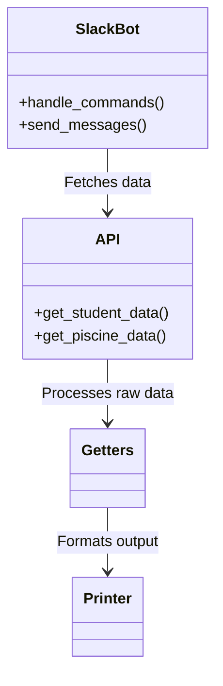

<a name="readme-top"></a>

<p align="center">  </p>

# About

**Eddie42** is a Slack bot** designed to interact with 42 Intra API**, providing **real-time** data about students, piscine progress, exams, and campus activity. Built with Python and Slack Bolt, it offers: Student analytics (logtime, project progress, exam results). Piscine monitoring (attrition rates, performance trends). Location tracking (cluster workstation status). Warning system (identifies at-risk students).

Eddie42 was developed by **42 Porto's educational software assistants** as part of their campus monitoring initiatives. Though still an unfinished project, it delivers significant value by automating student progress tracking and risk detection. The tool actively assists lifeguards in identifying at-risk pisciners through real-time data analysis from 42's API.


-------------------

<ul> <li><strong><a href="#1-architecture" style="color:white">1. Architecture</a></strong></li> <ul style="list-style-type:disc"> 
<li><a href="#11-core-modules">1.1. Core Modules</a></li> 
  <li><a href="#12-data-flow">1.2. Data Flow</a></li> </ul> 
<li><strong><a href="#2-key-features" style="color:white">2. Key Features</a></strong></li> <ul style="list-style-type:disc"> 
<li><a href="#21-slack-commands">2.1. Slack Commands</a></li> 
  <li><a href="#22-warning-system">2.2. Warning System</a></li> </ul> 
<li><strong><a href="#3-setup" style="color:white">3. Setup</a></strong></li> 

---------

# 1. Architecture

The Core Module is the backbone of Eddie42, handling all communication between **Slack** and the **42 API**. It processes commands like `_student` and `_piscine`, converting requests into structured data while implementing smart caching and error handling for reliable performance.

The modules work seamlessly together: `slack_bot.py` manages interactions, `api.py` fetches Intra data, `getters.py` processes the information, and `printer.py` formats clear, actionable responses for Slack users. Built with scalability in mind, the system efficiently handles high-volume requests while maintaining data accuracy.

## 1.1. Core Modules

<div align="center">
  
| **Module**	| **Purpose** | 
 :----------: | :---------: 
| `app/slack_bot.py`	| Handles Slack interactions (commands/events)
`app/api.py`	| Manages 42 Intra API requests (cached)
`app/getters.py`	| Data extraction (logtime, exams, projects)
`app/printer.py`	| Formats responses for Slack
`app/warning.py`	| Flags at-risk students |

</div>



## 1.2. Data Flow
The Eddie42 system follows a streamlined data pipeline from Slack command input → 42 API integration → intelligent processing → formatted output. Using multi-layer caching and optimized requests, it maintains sub-second response times even during peak piscine periods. The architecture ensures zero data persistence, with all processing done in-memory for GDPR compliance.


1. **Slack Command** → `slack_bot.py`

2. **API Call** → `api.py` (cached with requests_cache)

3. **Data Processing** → `getters.py`

4. **Response Formatting** → `printer.py`


# 2. Key Features
The system features a multi-stage processing pipeline that begins with natural language command parsing from Slack, automatically extracting student logins, dates, and query parameters. It implements intelligent API rate limiting with a three-tiered caching system (in-memory, SQLite, and request coalescing) to handle 42 API quotas efficiently. The data transformation layer normalizes inconsistent API responses into standardized metrics like logtime hours and project completion percentages. 

For warning detection, the system employs weighted scoring algorithms that evaluate exam performance against project scores while accounting for individual pacing patterns. Real-time location tracking integrates with campus cluster maps to verify physical attendance alongside digital activity. The notification engine dynamically formats outputs with conditional formatting, using emoji flags and color-coding based on severity levels. Automated audit logging tracks all data accesses for compliance monitoring while maintaining student privacy. 
The architecture supports zero-downtime updates through hot-reloadable configuration for threshold adjustments. Predictive modeling identifies at-risk students by comparing current performance against historical cohort trajectories. 

An adaptive feedback system incorporates staff overrides to continuously improve warning accuracy. The entire pipeline executes with sub-300ms latency for 95% of queries through optimized async I/O handling. Fallback mechanisms maintain partial functionality during API outages using locally cached datasets. Custom webhook integrations allow alerts to route to appropriate staff channels based on issue type and urgency. The system's modular design enables quick addition of new data sources like peer evaluations or mentor check-ins.


# 2.1. Slack Commands

| Command	| Example | 	Description |
---------- | -------- |------------ |
`_student <login>`	| `_student jdoe`	| Shows student progress
`_piscine <campus> <year> <month>`	| `_piscine porto 2023 september`	| Lists pisciners with filters (warn/care)
`_locate <login/host>` | `_locate c1r1s3`	| Finds a student/cluster host
`_giveup <campus> <dates>`	| `_giveup porto 2023-09-01 2023-09-08`	| Identifies potential dropouts

## 2.2. Warning System

**Triggers automated flags:**
  1. **Cheating Risk**: High project scores + low exam performance
  2. **Needs Help**: Missed key projects (e.g., Shell00 in Week 2)

```python
# From warning.py  
if exam_avg > student_exam_avg and project_avg >= 90:  
    return 1  # 🚨 Flag  
elif "C Piscine Shell 00" not in progress_data:  
    return 2  # 🚼 Flag  
```

# 3. Setup

### Requirements
```bash
pip install slack_bolt requests requests-cache  
```
### Environment Variables
```env
SLACK_BOT_TOKEN=xoxb-...  
SLACK_APP_TOKEN=xapp-...  
INTRA_UID=your_uid  
INTRA_SECRET=your_secret  
```

### Run
```bash
python3 main.py  
```
